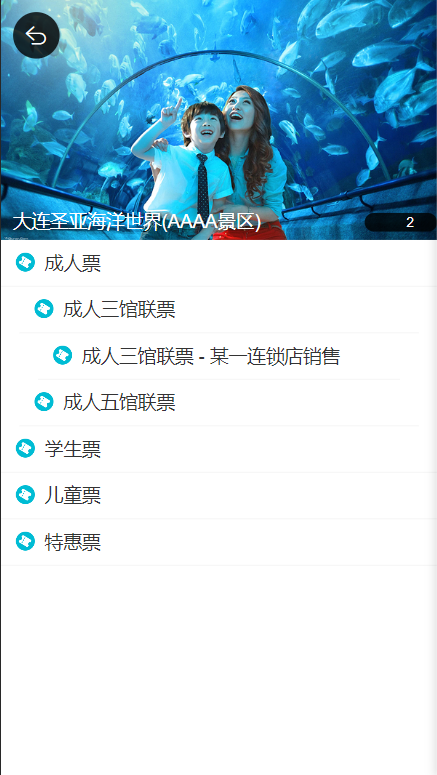

# My Project: vue2+Vue3（重构）去哪儿网webapp 技术栈：Vue+webpack+vue-router+vuex+axios+element UI+ swiper

- 三个大组件：首页、城市选择详情页、详情页

- 开发方式是用模块化：一个大组件里会有多个子组件，由这些子组件来'填充'大组件，这样方便后续维护:

- city
    - city.vue
    - components
        - city-header.vue
        - etc...

## 主要实现的功能

- 首页组件轮播图实现和icon组件的遍历实现，图片如下：

- 城市选择页的字母表的滚动功能实现、以及vuex的共享数据的实现：

- 景区详情页的递归组件的层级排布功能实现：

   
### 做项目过程中主要遇到的问题：

- Git的坑，相信很多小白新手或者有一些经验的人遇到git棘手的问题时也不知道如何解决，比如这个：

1. 当你对github仓库拉取请求或提交时，如果报这样的错OpenSSL SSL_read: Connection was reset, errno 10054....，你可能会以为是网络的问题、防火墙没设置好、没科学上网等等；我当时也以为是这样，于是就去防火墙那设置允许gitxxx，结果重启后还是不行，然后多次开关网络也不行。直到我搜到这篇文章，虽然写得简洁，但是句句都是干货：

- [git报错-ssl](https://blog.csdn.net/weixin_40908748/article/details/122367878)

- 2023.12.6(更新):我还是继续说上次的问题，我发现Git操作出问题不止是：OpenSSL SSL_read: Connection was reset, errno 10054....，也有fatal: unable to access '你的仓库地址': Failed to connect to github.com port 443 after 21110 ms: Timed out的报错，那我之前都是谷歌后得到的结果是取消全局代理：git config --global --unset http.proxy 和git config --global --unset https.proxy这种方式（注意弄完后要关掉git重启后才能继续操作git pull和git push等。

- [git报错-443端口](https://blog.csdn.net/Hodors/article/details/103226958)

- 但是！这样弄解决不了根本问题，而每次出问题再去调试太浪费时间了，索性直接设置全局代理:很多人以为弄代理就是把自己项目的端口接上去，但其实这样是行不通的，还是会报错：

-git config --global http.proxy http://127.0.0.1:8080
 
-git config --global https.proxy http://127.0.0.1:8080  行不通！你如果科学上网的话，应该把科学上网的端口接上去，这样才一路畅通无阻：

-git config --global http.proxy http://127.0.0.1:7890

-git config --global https.proxy http://127.0.0.1:7890   这里我用的是某云科学上网，端口就是7890，然后注意点是，一次一次把代理弄好，而不是两个同时弄，弄完后记得重启git，在执行git操作。

2. 第二个问题就是还是有点小粗心，我觉得编程还是很注意细节的，往往你解决半天的问题只是因为细节上的疏忽。因此一定要学会排错。学会多种解决bug的方法是特别重要的，我在日常做项目会用到的console.log、breakpoint（断点）、开发者工具的调试（如添加样式处排查样式错误），那接下来我会列出之前学过的比较好的文章（我就不自己说了，那些博客文说得比我好！）

- [JavaScript断点调试心得](https://www.cnblogs.com/mqfblog/p/5397282.html)

- [国外知名编程程序问题解答社区](https://stackoverflow.com/?newreg=38c4976ed54e426aa2fabf479d3fdbf3)——是一个知名的编程问答网站，旨在帮助程序员在编程过程中解决问题。这个网站允许用户提出技术问题并获得其他社区成员的回答和解决方案。Stack Overflow 上的问题和答案涵盖了各种编程语言、开发工具和计算机科学领域的话题。它已经成为全球开发者社区中的重要资源，许多程序员在工作中常常使用它来寻找编程方面的帮助和支持。

- [思否-博客质量比较好的平台](https://segmentfault.com/)——个中国的技术社区和招聘平台。它为技术爱好者和专业人士提供了一个交流和学习的平台，用户可以在这里分享技术文章、参与讨论、寻找工作机会等。思否还举办技术活动和线下聚会，促进技术社区的发展和交流。如果您对技术有兴趣，思否可能是一个有用的资源，可以帮助您与其他技术人员建立联系并获取有关技术领域的信息。

3. 第三个问题就是太多东西在更新迭代了！呜呜呜呜完全完全跟不上速度啊，现在真的在拼命学英语，每天科学上网出去看新的技术，另一边又在巩固基础，大家真的要好好学英语，国外教学平台的质量真的好，现在国内视频教学（开源）平台都有个非常致命的毛病——废话实在是太多了，一个视频40%的时间都在讲废话，我原本就是觉得官网太枯燥看不下去所以才去看视频，结果.....而且看视频是被动输入，和自己主动看文档完全是两码事，前者只是理解并没有思考，这样对自己的基础并不好，后者好歹还能边看边思考边跟着敲一敲。

- 我想推荐几个国内外知名的教学平台——开源/付费：

- 开源

- [freecodecamp](https://www.freecodecamp.org/)——这个我很推荐，因为非常适合入门，有些题目也非常新颖。

- [youtube](https://www.youtube.com/)——油管就不用多说了，想要啥有啥，很多新技术教学视频都在上面，如果英文不好可以安装ejoy字幕插件进行实时翻译即可，但我更建议你学好英文，开英文字幕去学，因为很多内容翻译成中文理解起来就很怪。

- [reddit](https://www.reddit.com/?rdt=41977)——红迪，类似国内的豆瓣，但它却是国外最火爆的知名社区平台，我平时有事没事就去上面看最新的资讯和讨论，如GPT，也可以加入相关编程小组进行学习。

- [百度前端技术学院](https://ife.baidu.com/encyclopedia/readme1.html)——这个平台的题目真的挺好，注重基础，给的题目偏考察你的JavaScript水平，而且只给你要求和设计图让你去实现相关功能，也不会有官方的开源给你参考。当然有质量的题目都是好几年前的，值得一试。

- 付费

- [udemy](https://www.udemy.com/)——备受好评的学习平台，也是我之前冲浪才发现这个平台的好用，之前一直对js的一些概念不清楚，听了相关视频课（试听）后恍然大悟。因此我往后会花时间在上面和youtube，学习新技术，加油加油！

